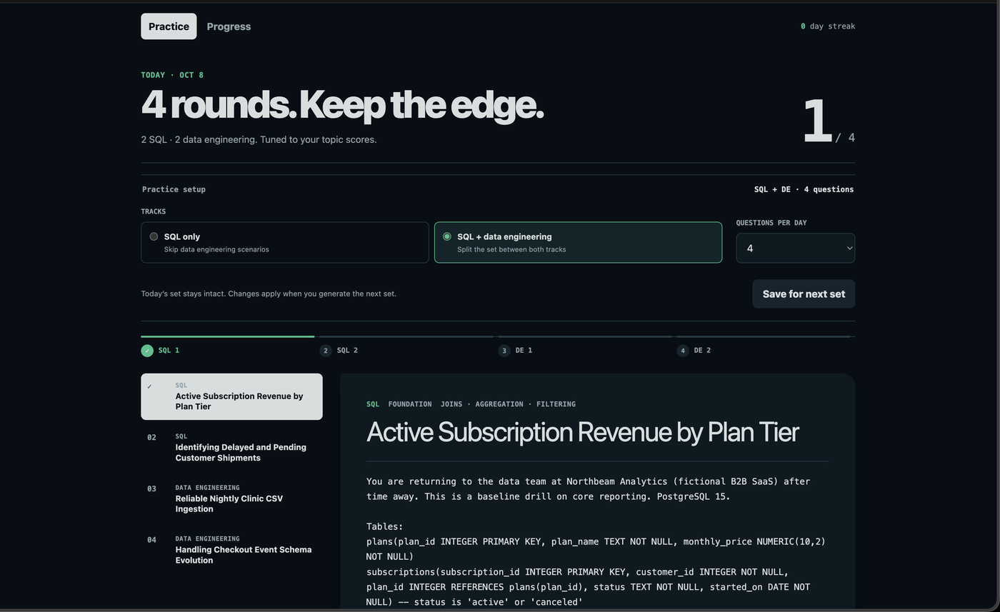
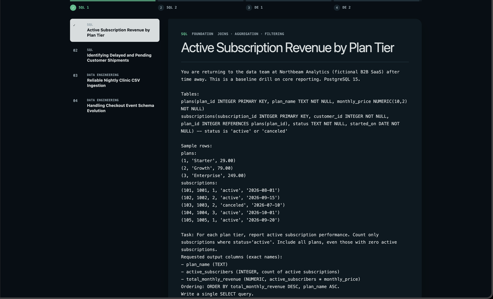
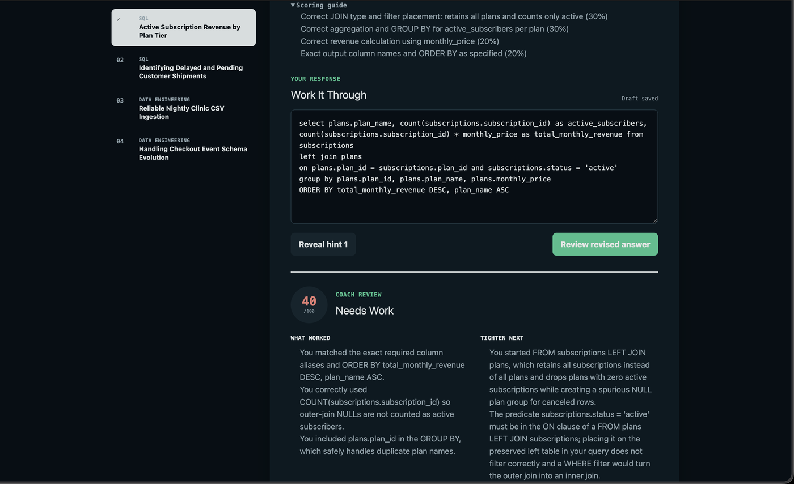
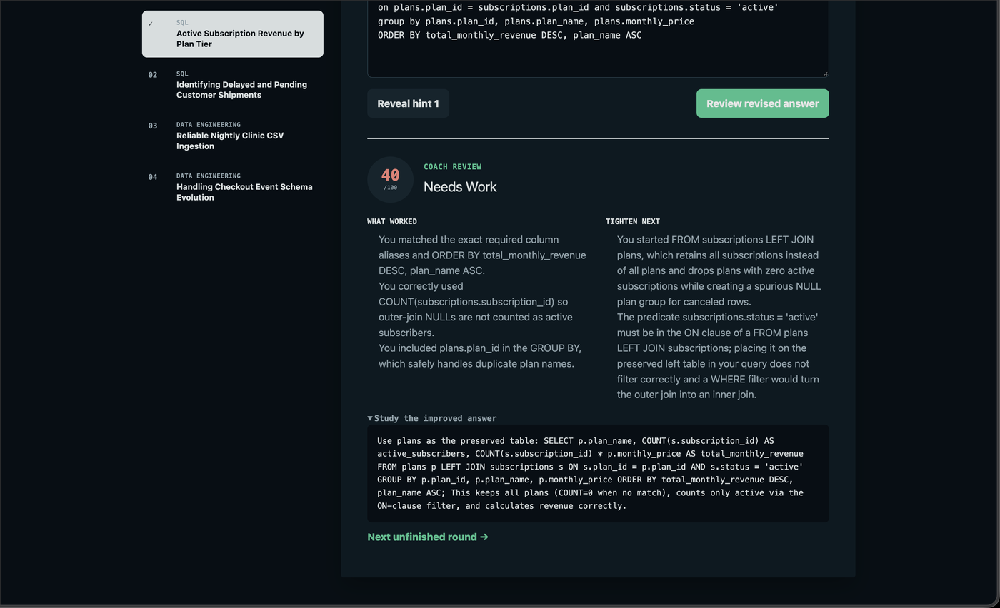
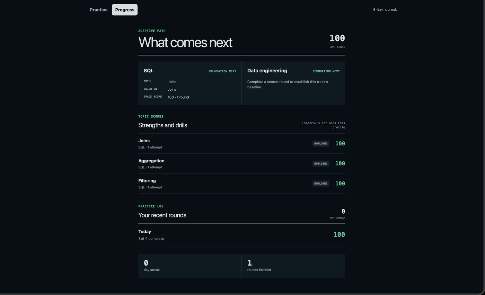
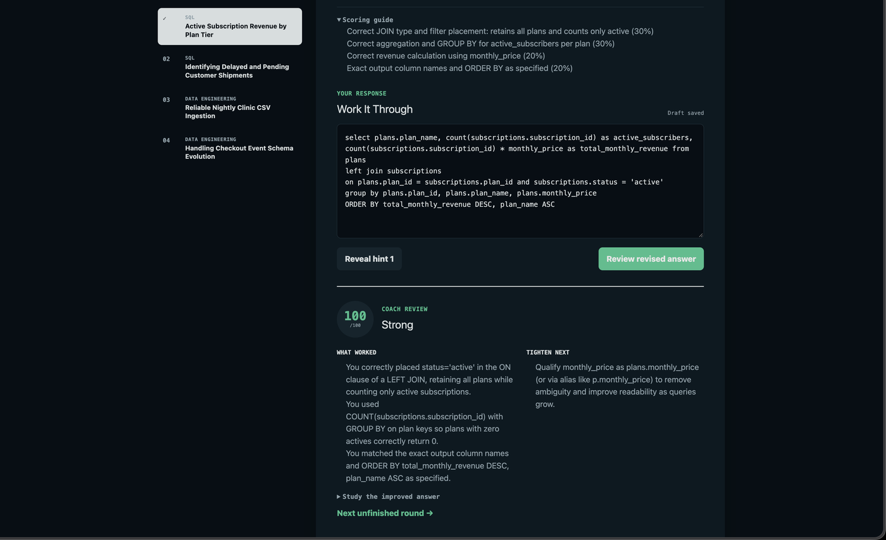

# Daily SQL & Data Engineering Practice

A daily practice app for data engineers: every day you get **2 SQL problems + 2 data-engineering scenario questions**, write your answers, and get AI coach reviews with scores. Difficulty adapts by topic based on your past scores — strong areas get stretched, weak areas get drilled.

**Bring your own AI — two ways.** The recommended path is **Sign in with ChatGPT** (official OpenAI DevDay flow): click one button, sign in with your ChatGPT account, and all AI calls run against your own Plus/Pro subscription quota. No API key. Prefer keys? The API-key fallback supports OpenAI, Anthropic, Ollama (free, local), or any OpenAI-compatible endpoint. With neither configured, the app still works: daily sets rotate through a built-in 16-problem seed bank and answers are saved (just without AI reviews).

## Screenshots


*Practice setup: SQL-only or SQL + data engineering, with selectable questions per day.*


*Problem detail: schema, sample rows, and the exact task.*


*Coach review: score, what worked, and what to tighten next.*


*Improved answer plus a pointer to the next unfinished round.*


*Progress: adaptive path, topic strengths and drills, and your practice log.*


*Revised answer earning a strong coach review.*

## Quickstart

Requires Node 20+.

```bash
npm install
npm run build
npm start
```

Open http://localhost:3000. That's it — the SQLite database (`data/app.db`) is created and migrated automatically on first boot.

| Script | What it does |
|---|---|
| `npm run dev` | Run API + client with hot reload (two terminals in one) |
| `npm run build` | Build the client into `server/public` |
| `npm start` | Serve the API + built client on `$PORT` (default 3000) |

## Sign in with ChatGPT (recommended)

This uses OpenAI's official **Sign in with ChatGPT** flow for open-source apps (launched at DevDay, Sept 2026). Self-serve — no developer registration needed.

**How it works:**

1. Run the app (`npm start`) and click **Sign in with ChatGPT** in the header.
2. You're redirected to OpenAI to authorize this app (Authorization Code + PKCE, loopback redirect to `http://127.0.0.1:3000/api/auth/callback`).
3. The app exchanges the code for tokens (public client, no secret), validates the ID token signature, and stores encrypted tokens locally.
4. All AI calls go to `POST https://api.openai.com/v1/responses` with **your** access token, `store: false`, streaming SSE — usage counts against **your ChatGPT plan**.

**What you need to know:**

- Requires a **ChatGPT Plus or Pro** subscription for plan-backed usage.
- You configure a **weekly per-app usage cap inside ChatGPT** — the app can't raise it. When the cap is hit, plan-backed requests pause and the app shows a "plan cap reached" notice with a [Manage usage](https://chatgpt.com/settings/usage) link.
- Usage counts against your ChatGPT plan, not an API bill.
- Tokens are encrypted at rest (AES-256-GCM). Set `TOKENS_KEY` in `.env` for a stable key; otherwise a random one is generated and stored in `data/app.db` (the app warns loudly at boot).
- You can disconnect anytime — the header's **Disconnect** button wipes stored tokens.
- More: [OpenAI's Sign in with ChatGPT docs](https://developers.openai.com) and the [Apps SDK](https://developers.openai.com/apps-sdk/).

## API-key fallback

No Plus/Pro, or prefer keys? Copy `.env.example` to `.env` and fill in one provider block, then restart the server.

```bash
cp .env.example .env
```

| Variable | Required | Notes |
|---|---|---|
| `AI_PROVIDER` | yes | `openai` \| `anthropic` \| `custom` |
| `AI_API_KEY` | yes | Your key for the provider |
| `AI_MODEL` | no | Defaults: `gpt-4o-mini` (openai), `claude-haiku-4-5` (anthropic), `llama3.1` (custom) |
| `AI_BASE_URL` | for `custom` | e.g. Ollama / OpenRouter / LM Studio endpoint |
| `PORT` | no | Default 3000 |

### OpenAI

```bash
AI_PROVIDER=openai
AI_API_KEY=sk-...
```

### Anthropic

```bash
AI_PROVIDER=anthropic
AI_API_KEY=sk-ant-...
```

### Ollama (free, local)

```bash
# first: ollama pull llama3.1   (or any model you prefer, then set AI_MODEL)
AI_PROVIDER=custom
AI_API_KEY=ollama
AI_BASE_URL=http://localhost:11434/v1
```

(Ollama ignores the key value, but the variable must be set.)

### OpenRouter

```bash
AI_PROVIDER=custom
AI_API_KEY=sk-or-...
AI_BASE_URL=https://openrouter.ai/api/v1
AI_MODEL=anthropic/claude-haiku-4-5   # or any model id
```

Use the **Setup** tab in the app to check status (`GET /api/ai/status` — the key is never exposed) and test the connection (`POST /api/ai/test`).

## How it works

- **Today** — the daily set (default 2 SQL + 2 DE; configurable in Setup). Generated by your AI on first visit each day (original problems, PostgreSQL 15 for SQL), or rotated from the seed bank when no provider is configured. Each card has progressive hints, an answer box, and a reference-answer reveal. Submitting sends your answer to the AI coach for a 0–100 score, verdict, strengths, gaps, and an improved answer.
- **Adaptive difficulty** — every scored attempt updates per-topic stats. Per track, average ≥ 80 → advanced, ≥ 60 → intermediate, else foundation. Topics averaging below 60 (2+ attempts) are flagged weak and the generator is told to drill them.
- **Progress** — streak (consecutive active days), per-track recommended difficulty, topic score table, weak-topic list, and a 14-day activity chart.
- **Seed bank** — `data/seed-bank.json` holds 16 hand-written problems (8 SQL, 8 DE). Used automatically when AI isn't configured, rotating per track with persisted offsets so consecutive days don't repeat.

## Practice settings

In **Setup → Practice settings** you can toggle each track (SQL / Data engineering) and choose how many questions per day per track (0–10, default 2+2). SQL-only mode is just the Data-engineering toggle switched off. Changes apply from tomorrow's set; **Regenerate today's set** applies them immediately — it's blocked once you've attempted anything today, to protect your work.

| Method | Path | Notes |
|---|---|---|
| GET | `/api/settings` | `{ sql_enabled, de_enabled, sql_count, de_count }` |
| PUT | `/api/settings` | Same shape; 400 unless counts are integers 0–10 and at least one track is enabled with ≥ 1 question |

## Project structure

```
├── server/
│   ├── index.js      # Express app, all API routes, static client serving
│   ├── db.js         # node:sqlite connection + auto-migrations (incl. users, config)
│   ├── auth.js       # Sign in with ChatGPT: PKCE flow, JWKS validation, refresh, sessions
│   ├── planClient.js # Plan-backed calls via /v1/responses SSE (store:false, stream:true)
│   ├── crypto.js     # AES-256-GCM token encryption, session signing
│   ├── ai.js         # API-key fallback providers (openai/anthropic/custom), JSON mode
│   ├── prompts.js    # generation + review prompts, strict payload validation
│   ├── adaptive.js   # per-track difficulty, weak topics, avoid-list
│   ├── settings.js   # practice settings (track toggles, counts), seed offsets
│   ├── seed.js       # seed-bank rotation
│   └── test/         # node:test unit tests (auth URL, PKCE, JWT, SSE, error mapping)
├── client/           # Vite + React + TypeScript SPA (plain CSS)
│   └── src/views/    # Today, Progress, Setup
├── data/
│   ├── seed-bank.json  # 16 built-in problems (committed)
│   └── app.db          # SQLite database (created on boot, gitignored)
└── .env.example
```

## API overview

| Method | Path | Notes |
|---|---|---|
| GET | `/api/auth/login` | Start Sign in with ChatGPT (302 to OpenAI) |
| GET | `/api/auth/callback` | OAuth callback: validates state, exchanges code, sets session cookie |
| GET | `/api/auth/me` | `{ signedIn, planScopeGranted, user }` — tokens never exposed |
| POST | `/api/auth/logout` | Disconnect: wipes stored tokens + session |
| GET | `/api/ai/status` | API-key status + plan auth state (key never leaked) |
| POST | `/api/ai/test` | Tiny ping prompt → `{ ok, message }` (API-key path) |
| GET | `/api/today` | Today's set; generates + persists if missing (AI, else seed rotation) |
| POST | `/api/today/regenerate` | Force-regenerate today's set |
| GET | `/api/challenges/:id` | One challenge with attempts + reference answer |
| POST | `/api/challenges/:id/attempt` | `{ answer }` → saves attempt, AI review (or graceful unconfigured response), updates stats |
| GET | `/api/progress` | Streak, recommended difficulty, topic stats, 14-day summary |
| GET | `/api/history` | Past practice days |

## License

MIT — see [LICENSE](LICENSE).
